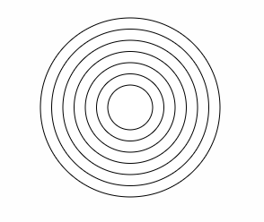
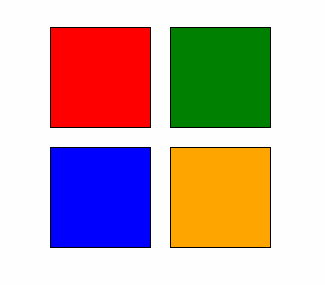
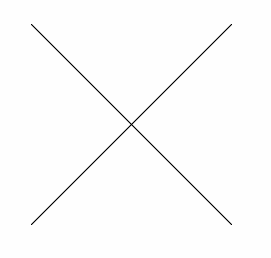
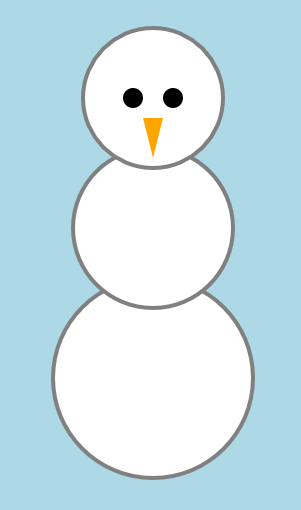

## Shapes

Try recreating these drawings using p5. Feel free to use different colors.

1. bullseye.js  
  

2. squares.js  

3. x.js  

4. dice.js    

5. snowman.js  

View all of your drawings at once by opening `index.html` in the browser. Or, view individual drawings by opening the html file inside their corresponding folder.
